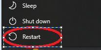
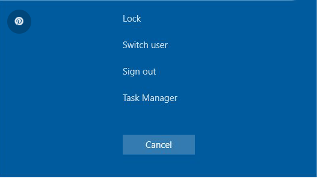
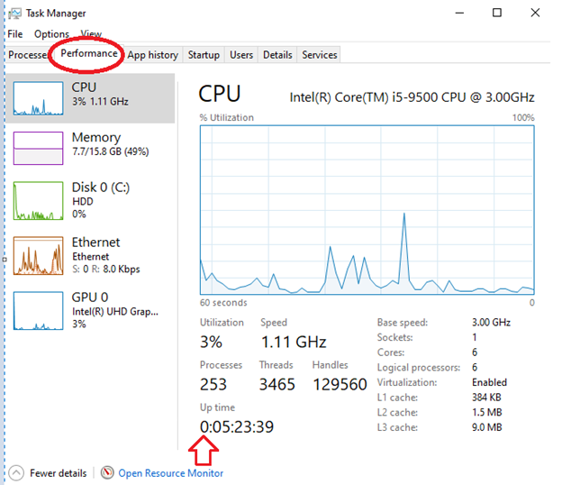

# Avatar Best Practices 
### Dekalb Community Service Board 

This is a one stop document containing all myAvatar best practices and trouble shooting guides.
Below is the Table of Context where the the main sections are 'Best Practices' and 'Common Problems'.
S

# Table of Contents

## 1. [Best Practices](#best-Practices)

- [Restarting After Every Shif](#frequent-restarts)

- [Long Uptimes](#long-uptimes)

## 2. [Common Problems](#common-problems)

- [Telehealth Connectivity](#telehealth-connectivity)

# Best Practices

This is a list of ways to ensure that myAvatar performs the best it possibly can for you. 
Following these best practices will help prevent slow downs, crashes, and errors. 
We at ITS hope you find them helpful and if you have any additions or comments, please let us know.

## Frequent Restarts:

At the end of your shift, restart your computer. Do not select the shut down option. See the screen capture below:

## Long Uptimes:

Open the task manager by pressing the ctrl, alt and del keys simultaneously. Then Select “Task Manager”

Select the “Performance”.  And then look at the “Up time” on the bottom of this window.  Refer to the screen capture below.  If that number above the arrow is greater than 0, then your system has not been properly restarted.

If you are finding that your system is slow, please follow the [Frequent Restarts](#frequent-restarts) instructions.

# Common Problems

## Telehealth Connectivity:

TODO: (Make Section on checking telehealth connectivity)